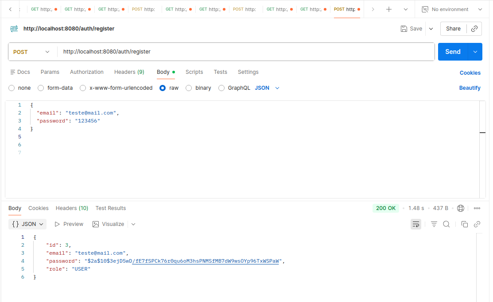
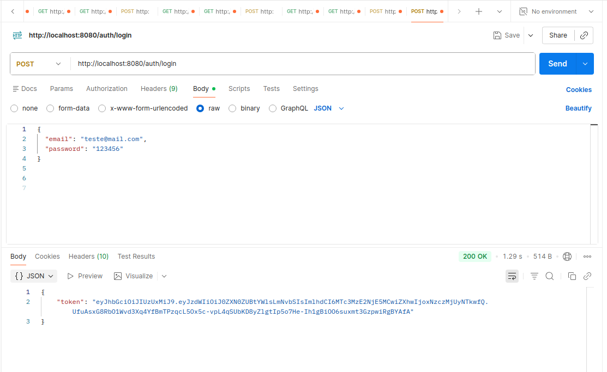
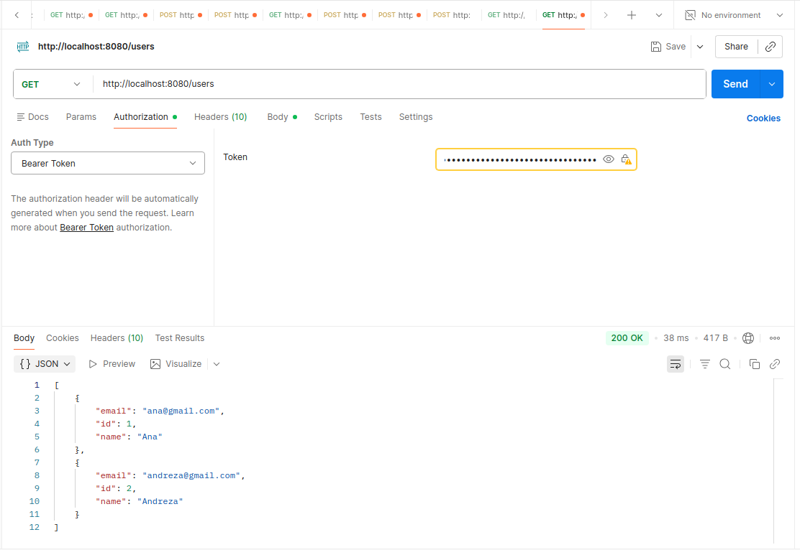
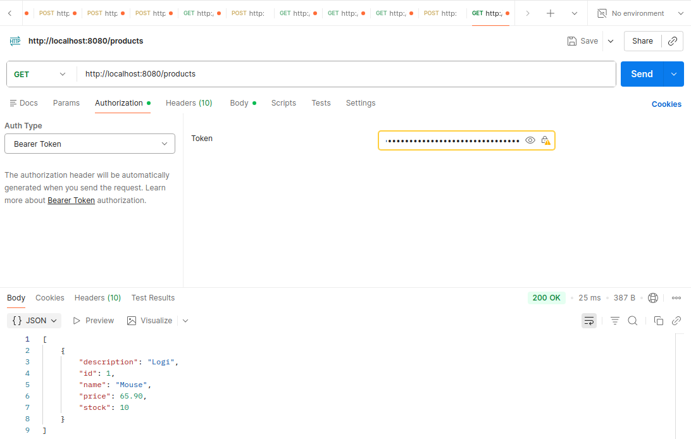
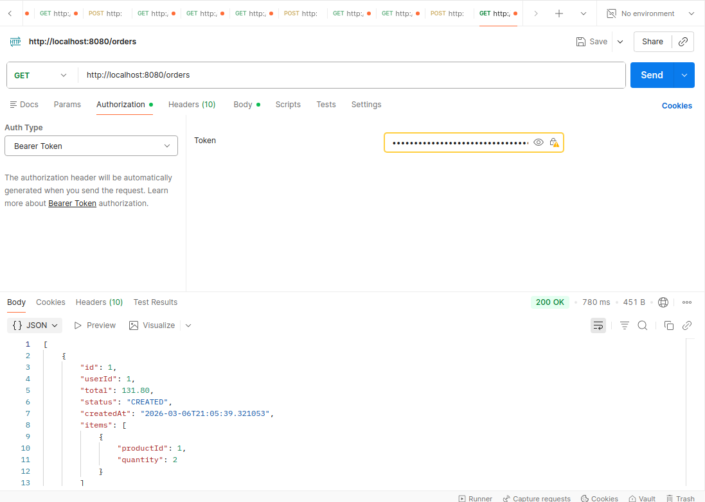

# 🛍️ Plataforma de Pedidos Online

## 📌 Sobre o Projeto

A **Plataforma de Pedidos Online** é uma aplicação backend construída com **arquitetura de microsserviços** utilizando **Spring Boot**.

O sistema simula uma plataforma de pedidos onde usuários podem:

✔ Realizar autenticação <br>
✔ Gerenciar usuários <br>
✔ Visualizar produtos <br>
✔ Criar pedidos <br>

A comunicação entre serviços ocorre através do **OpenFeign**, enquanto o **API Gateway** centraliza o roteamento das requisições.

A autenticação da aplicação é baseada em **JWT (JSON Web Token)**, garantindo segurança no acesso aos serviços.

<br>

## 🎓 Contexto do Projeto

Este projeto foi desenvolvido como **desafio prático da plataforma DIO (Digital Innovation One)** no módulo:

🐳 **Docker: Utilização prática no cenário de Microsserviços**

Durante o desenvolvimento foram aplicados conceitos importantes como:

- Arquitetura de microsserviços
- Comunicação entre APIs
- Segurança com JWT
- Containerização com Docker
- Orquestração com Docker Compose

<br>

## 🧠 Tecnologias Utilizadas

### 💻 Backend

-  Java 21
-  Spring Boot
-  Spring Security
-  Spring Data JPA
-  OpenFeign
-  Spring Cloud Gateway
-  JWT

### 🗄 Banco de Dados

-  PostgreSQL

### ⚙️ Infraestrutura e DevOps

-  Docker
-  Docker Compose
-  Maven

<br>

## 🏗 Arquitetura da Aplicação

A aplicação segue o padrão de **arquitetura distribuída baseada em microsserviços**, onde cada serviço possui responsabilidade única.

```sql
                Client
                  |
                  v
            API Gateway
                  |
    --------------------------------
    |        |         |           |
    v        v         v           v
 Auth     User      Product      Order
Service  Service     Service     Service
```

📌 **API Gateway** atua como ponto de entrada da aplicação, sendo responsável por:

- Roteamento das requisições
- Centralização de acesso aos serviços
- Aplicação de regras de segurança

<br>

## 🔧 Microsserviços

| Serviço            | Porta | Descrição                            |
| ------------------ | ----- | ------------------------------------ |
| 🚪 API Gateway     | 8080  | Roteamento das requisições           |
| 🔐 Auth Service    | 8084  | Autenticação e geração de tokens JWT |
| 👤 User Service    | 8081  | Gerenciamento de usuários            |
| 📦 Product Service | 8082  | Gerenciamento de produtos            |
| 🧾 Order Service   | 8083  | Processamento de pedidos             |

<br>

## 🔗 Comunicação entre Microsserviços

A comunicação entre os serviços é feita utilizando **OpenFeign**, permitindo chamadas HTTP declarativas entre APIs.

### Fluxo de exemplo
```sql
Order Service
     |
     |---- consulta dados do usuário
     v
User Service

Order Service
     |
     |---- consulta produto
     v
Product Service
```
Esse modelo promove:

✔ Baixo acoplamento <br>
✔ Alta escalabilidade <br>
✔ Separação clara de responsabilidades <br>

<br>

## 🔐 Segurança da Aplicação

A autenticação da aplicação utiliza **JWT (JSON Web Token)**.

### Fluxo de autenticação

1️⃣ O cliente envia login para o Auth Service <br>
2️⃣ O serviço gera um token JWT <br>
3️⃣ O cliente envia o token nas requisições <br>
4️⃣ O API Gateway valida o token <br>
5️⃣ A requisição é encaminhada para o serviço correspondente

<br>

## 🐳 Containerização

Todos os serviços são executados em **containers Docker**, garantindo:

✔ Padronização do ambiente <br>
✔ Facilidade de execução <br>
✔ Isolamento dos serviços

A orquestração é feita com **Docker Compose**, permitindo subir toda a arquitetura com um único comando.

<br>

## 📡 Endpoints da API

> Todas as requisições devem ser realizadas através do **API Gateway**, que é responsável pelo roteamento para os microsserviços internos.

Base URL:

http://localhost:8080

---

### 🔐 Autenticação

| Método | Endpoint |
|------|------|
| POST | /auth/register |
| POST | /auth/login |

---

### 👤 Usuários

| Método | Endpoint |
|------|------|
| POST | /users |
| GET | /users |
| PUT | /users/{id} |
| DELETE | /users/{id} |

---

### 📦 Produtos

| Método | Endpoint |
|------|------|
| POST | /products |
| GET | /products |
| PUT | /products/{id} |
| DELETE | /products/{id} |

---

### 🧾 Pedidos

| Método | Endpoint |
|------|------|
| POST | /orders |
| GET | /orders |
| GET | /orders/{id} |
| PUT | /orders/{id} |
| DELETE | /orders/{id} |


<br>

## ▶ Como Executar o Projeto

### 1️⃣ Clonar o repositório

```bash
git clone https://github.com/andreza1freitas/microsservicos-pedidos
```
### 2️⃣ Acessar o projeto

```bash
cd microsservicos-pedidos
```

### 3️⃣ Acessar a pasta docker

```bash
cd docker
```

### 4️⃣ Subir os containers
```bash
docker compose up --build
```
Após a execução, todos os microsserviços estarão disponíveis localmente.

<br>

## 🧪 Testes da API com Postman

Os endpoints da aplicação foram testados utilizando o **Postman**, permitindo validar o funcionamento da autenticação, criação de usuários e gerenciamento de produtos através do **API Gateway**.

Fluxo de testes realizado:

1️⃣ Registro de usuário <br>
2️⃣ Login para obtenção do token JWT <br>
3️⃣ Acesso aos endpoints protegidos enviando o token no header da requisição

Header utilizado nas requisições autenticadas:

```css
Authorization: Bearer {token}
```

<br>

Abaixo estão alguns exemplos de requisições testadas através do Postman.

**1. Registrar usuário**




**2. Login**




**3. Acesso aos endpoints com token**

Após realizar o login, o token JWT deve ser enviado no header das requisições.

#### Exemplos de testes

**Usuários**



**Produtos**



**Pedidos**



<br>

## 🎯 Conceitos Aplicados

Durante o desenvolvimento deste projeto foram aplicados conceitos importantes de arquitetura backend moderna:

- Arquitetura de microsserviços
- Comunicação entre serviços com OpenFeign
- API Gateway
- Segurança com JWT
- Containerização com Docker
- Orquestração com Docker Compose
- APIs REST com Spring Boot
- Persistência com Spring Data JPA

<br>

### 👩‍💻 Autora

Desenvolvido por **Andreza Freitas**

Projeto desenvolvido para fins educacionais e profissionais.


